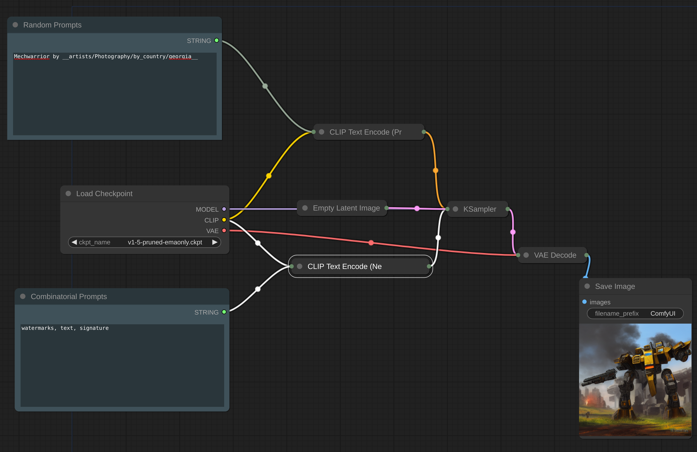
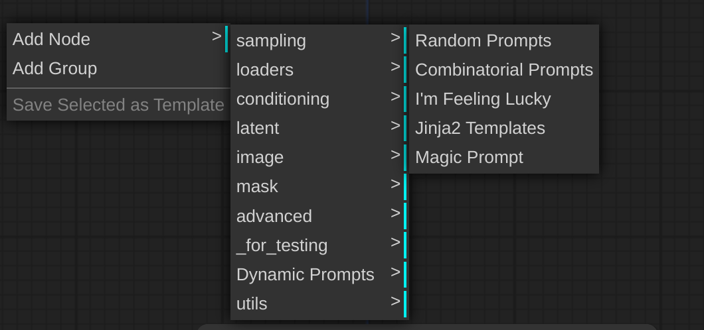

# ComfyUI-DynamicPrompts Custom Nodes



ComfyUI-DynamicPrompts is a custom nodes library that integrates into your existing ComfyUI Library. It provides nodes that enable the use of [Dynamic Prompts](https://github.com/adieyal/dynamicprompts) in your ComfyUI. The nodes provided in this library are:

1. [Random Prompts](https://github.com/adieyal/sd-dynamic-prompts/blob/main/docs/SYNTAX.md#variants) - Implements standard wildcard mode for random sampling of variants and wildcards.
2. [Combinatorial Prompts](https://github.com/adieyal/sd-dynamic-prompts/blob/main/docs/SYNTAX.md#combinatorial-sampler) - Iterates through every possible combination of random values in a prompt.
3. [I'm Feeling Lucky](https://github.com/adieyal/dynamicprompts#im-feeling-lucky) - Uses the given prompt to download a related prompt from Lexica.art.
4. [Magic Prompt](https://github.com/adieyal/dynamicprompts#magic-prompt) - Employs a neural network to add relevant modifiers to your prompt.
5. [Jinja2 Templates](https://github.com/adieyal/dynamicprompts#jinja2-templates) - Allows you to write prompts using Jinja2 templates.

Nodes can be found in the Dynamic Prompts menu:


## Useful Links
* [Dynamic Prompts Home](https://github.com/adieyal/dynamicprompts)
* [Dynamic Prompts Syntax](https://github.com/adieyal/sd-dynamic-prompts/blob/main/docs/SYNTAX.md)
* [Dynamic Prompts Extension for Auto1111](https://github.com/adieyal/sd-dynamic-prompts)
* [Tutorial](https://github.com/adieyal/sd-dynamic-prompts/blob/main/docs/tutorial.md)
* [Online Resources](https://github.com/adieyal/sd-dynamic-prompts/blob/main/docs/resources.md)

## Installation

### Using ComfyUI-Manager
1. Install [ComfyUI-Manager](https://github.com/ltdrdata/ComfyUI-Manager) if it isn't already.
2. Press Install Custom Nodes from the ComfyUI-Manager menu
3. Search for dynamicprompts
4. Click install

### Manual installation

Follow the steps below to install the ComfyUI-DynamicPrompts Library:

1. Clone the repository:
   ```
   git clone https://github.com/adieyal/comfyui-dynamicprompts ComfyUI/custom_nodes/
   ```
2. Install the required Python packages:
   ```
   python -m pip install -r ComfyUI/custom_nodes/requirements.txt
   ```
3. Run install.py:
   ```
   python ComfyUI/custom_nodes/comfyui-dynamicprompts/install.py
   ```
4. `mkdir ComfyUI/wildcards`
5. (Optional) download a wildcard collection and copy it into this new wildcards folder.
6. Restart your ComfyUI.
7. Example workflows can be found in `ComfyUI/custom_nodes/comfyui-dynamicprompts/example_workflows`.

## Wildcards
ComfyUI-DynamicPrompts supports wildcard files in `.txt`, .`json` and .`yaml` ([example format](https://github.com/adieyal/sd-dynamic-prompts/blob/main/collections/publicprompts.yaml)) . This library looks for a wildcards folder either in `ComfyUI/wildcards` or `ComfyUI/custom_nodes/comfyui-dynamicprompts/wildcards`.

There are many pre-built wildcards collections available. Here are a few to get you started:
* [SD Dynamic Prompts built-in](https://github.com/adieyal/sd-dynamic-prompts/tree/main/collections)
* [Civitai wildcard packs](https://github.com/adieyal/sd-dynamic-prompts/blob/main/docs/resources.md#wildcard-packs)


## Node Outputs

All nodes in this library produce a String output that can typically be passed into Clip Text Encode Prompts. Both positive and negative nodes are supported.

Please note, since ComfyUI is inherently stateless, some nodes might have a slightly unexpected behavior:

- The Combinatorial Prompt generation iterates through all possible values in a cycle. For example, A `{red|green|blue}` ball will generate the following sequence:
  - A red ball
  - A green ball
  - A blue ball
  - A red ball
  - ...

- The I'm Feeling Lucky, Magic Prompt, and Jinja2 nodes have an optional auto refresh parameter. If set to `True`, a new prompt is generated for every iteration. However, if set to `False`, a prompt will be downloaded once and used for subsequent generations.

## Roadmap

1. This is a quick and dirty release with some known limitations such as non-configurable random seeds, inability to select the MagicPrompt model, and absence of several other configuration features.
2. Currently, the only way to view the generated prompt is through console output. A future release will introduce nodes to display the generate prompt on screen and to write it to a file.
3. It is not currently possible to chain generators, this functionality will be added in future releases.
5. The installation script will be  automated in the future for ease of use.
